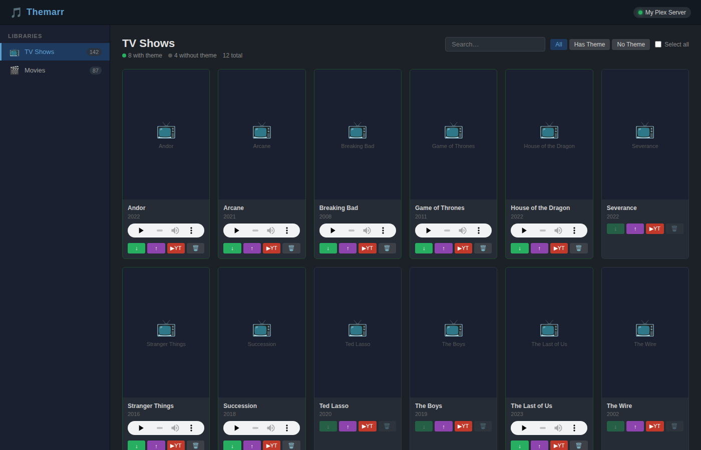
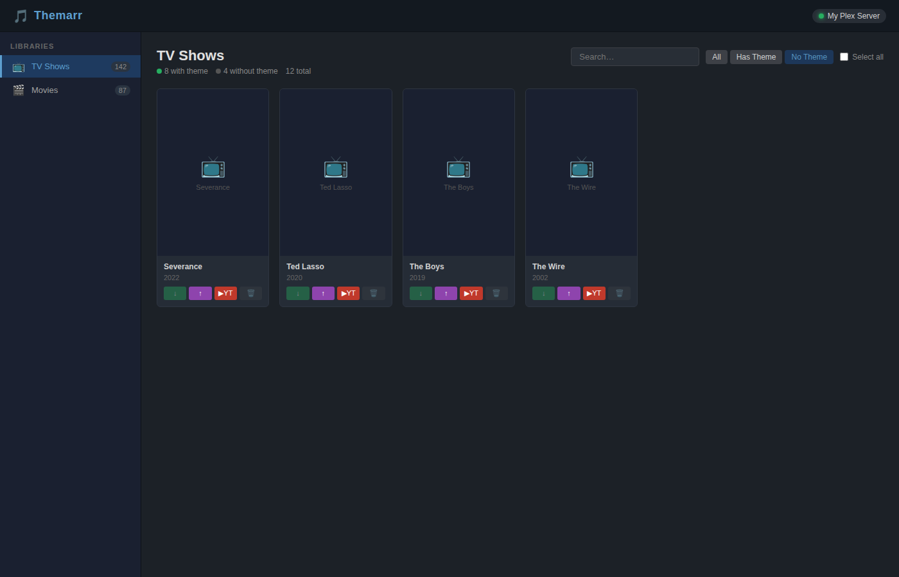
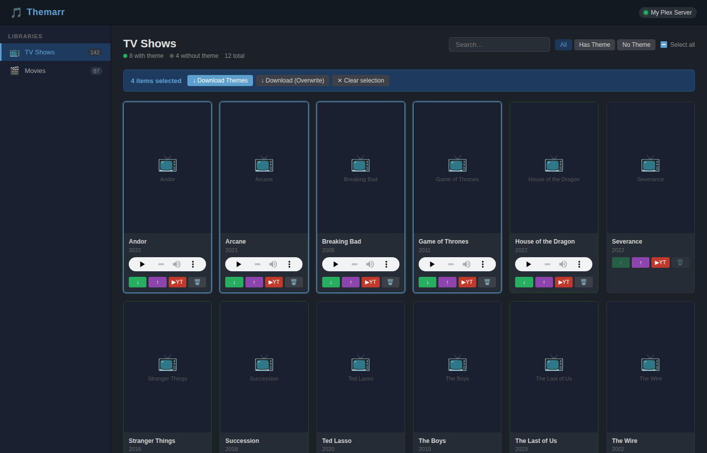
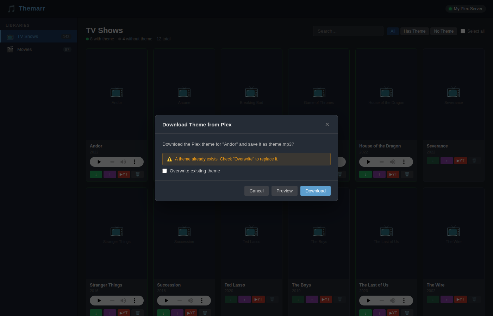
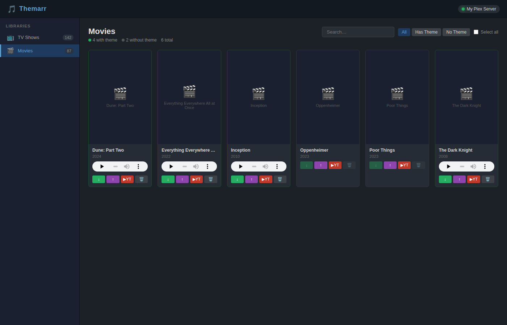

# Themarr

Themarr manages Plex theme music for TV shows and movies. It includes a Flask-based web UI, a CLI batch downloader, Sonarr/Radarr webhook integration, and Pushover notifications.

## Screenshots

| Welcome | TV Shows library |
|---|---|
|  |  |

| Filter: No Theme | Bulk selection |
|---|---|
|  |  |

| Download modal | Movies library |
|---|---|
|  |  |

## Features

- **Web UI** — Sonarr/Radarr-inspired dark theme, poster thumbnails, in-browser audio playback
- **Multi-select** — select any number of items and bulk-download their themes in one click
- **Per-item actions** — download from Plex (with preview), upload custom MP3, download from YouTube via `yt-dlp`, delete
- **Sonarr/Radarr webhooks** — auto-download themes when a new series or movie is added; staggered retry loop until Plex picks up the new item
- **Pushover notifications** — push notification on every theme download (optional)
- **CLI batch downloader** — process whole TV / movie libraries non-interactively
- **Docker-first** — multi-platform image (`linux/amd64`, `linux/arm64`) published to `ghcr.io`

## Quick start

```bash
cp .env.example .env
# edit .env with your Plex URL, token, and media paths

docker compose up --build
```

Open `http://localhost:8080`.

Or pull the pre-built image:

```bash
docker pull ghcr.io/timoverbrugghe/themarr:latest
```

## Requirements

- Docker / Docker Compose
- Plex Media Server with a TV Shows and/or Movies library
- Writable media folders mounted into the container
- `ffmpeg` (included in the Docker image) for YouTube audio extraction

## Configuration

### Core

| Variable | Required | Default | Description |
|---|---|---|---|
| `PLEX_URL` | ✅ | — | Plex server URL, e.g. `http://192.168.1.100:32400` |
| `PLEX_TOKEN` | ✅ | — | Plex API authentication token |
| `TV_SHOWS_HOST_PATH` | ✅ | `/mnt/tv` | Host path for TV shows, mounted as `/tv` in container |
| `MOVIES_HOST_PATH` | — | `/mnt/movies` | Host path for movies, mounted as `/movies` in container |
| `TV_SHOWS_PATH` / `TV_PATH` | — | `/tv` | Container path for TV shows |
| `MOVIES_PATH` | — | `/movies` | Container path for movies |
| `WEB_PORT` | — | `8080` | Published web port |
| `FLASK_DEBUG` | — | `false` | Enable Flask debug mode |
| `VERBOSE` | — | `false` | Verbose CLI logging |
| `VERBOSE_MATCHING` | — | `false` | Verbose match logging in CLI |
| `OVERWRITE` | — | `false` | Re-download even if `theme.mp3` already exists |

### Pushover notifications

Set both variables to enable push notifications on theme downloads.

| Variable | Description |
|---|---|
| `PUSHOVER_APP_TOKEN` | Pushover application token |
| `PUSHOVER_USER_KEY` | Pushover user or group key |

### Webhooks (Sonarr / Radarr)

Point Sonarr's webhook connection to `POST http://<themarr>:8080/api/webhooks/sonarr` and Radarr's to `/api/webhooks/radarr`.

| Variable | Description |
|---|---|
| `WEBHOOK_USERNAME` | HTTP Basic Auth username (leave blank to disable auth) |
| `WEBHOOK_PASSWORD` | HTTP Basic Auth password |
| `PLEX_RETRY_ATTEMPTS` | Max Plex polling attempts after add event (default: `10`) |
| `PLEX_RETRY_DELAY` | Base delay in seconds between retries — staggered linearly (default: `30`) |

On a `SeriesAdd` or `MovieAdded` event, Themarr starts a background thread that polls Plex for the new item and downloads its theme as soon as it appears. Delays are `30 s, 60 s, 90 s, …` up to `PLEX_RETRY_ATTEMPTS * PLEX_RETRY_DELAY` total wait time.

Supported webhook event types:

| Source | Handled events |
|---|---|
| Sonarr | `SeriesAdd`, `SeriesDelete` (logged, no action), `Test` |
| Radarr | `MovieAdded`, `MovieDeleted` (logged, no action), `Test` |

## Web app API

| Method | Path | Description |
|---|---|---|
| `GET` | `/api/status` | Plex connection health |
| `GET` | `/api/libraries` | List TV/Movie libraries |
| `GET` | `/api/libraries/<id>/items` | Items in a library with theme status |
| `GET` | `/api/poster/<key>` | Proxy Plex poster image |
| `GET` | `/api/items/<key>/theme` | Stream local `theme.mp3` |
| `GET` | `/api/items/<key>/theme/preview` | Stream Plex theme without saving |
| `POST` | `/api/items/<key>/theme/download` | Download theme from Plex |
| `POST` | `/api/items/<key>/theme/upload` | Upload a custom MP3 |
| `POST` | `/api/items/<key>/theme/youtube` | Download from YouTube URL |
| `DELETE` | `/api/items/<key>/theme` | Delete local `theme.mp3` |
| `POST` | `/api/bulk/theme/download` | Bulk-download themes (`ratingKeys` list, max 100) |
| `POST` | `/api/webhooks/sonarr` | Sonarr webhook receiver |
| `POST` | `/api/webhooks/radarr` | Radarr webhook receiver |

## CLI batch downloader

```bash
# Run once for TV + Movies
docker compose run --rm themarr python plex_theme_downloader.py
```

Or locally:

```bash
pip install -r requirements.txt
python3 plex_theme_downloader.py
```

## Docker image

The image is automatically built and pushed to GitHub Container Registry on every push to `main` and on semver tags.

```
ghcr.io/timoverbrugghe/themarr:latest   ← latest main build
ghcr.io/timoverbrugghe/themarr:main     ← explicit main tag
ghcr.io/timoverbrugghe/themarr:1.2.3   ← tagged release
```

Multi-platform: `linux/amd64` and `linux/arm64`.

## Validation

```bash
python3 -m py_compile plex_theme_downloader.py
python3 -m py_compile web_app.py
docker compose config
docker build -t themarr:test .
python3 -m pytest tests/ -v
```

